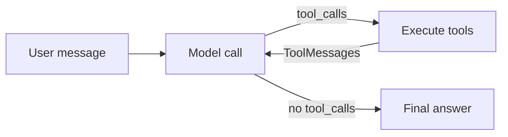

# LangChain — First Principles Deep Dive (V2)

**Curriculum V2 (revised) · September 2026 · LangChain 1.4 · LangGraph 1.2 · provider-neutral, Claude as reference**

!!! abstract "What changed from V1"
    V1 (March 2026) is preserved unchanged at [LangChain Path (V1)](../langchain-path.md). V2 fixes code that no longer runs (the V1 model `gemini-2.0-flash` has been shut down, and `create_react_agent` is not the LangChain 1.0 agent API), fills in the steps V1 left as placeholders, and adds the topics that became central during 2026: **context engineering, middleware, MCP, evals-as-tests, agent security, Deep Agents, harness engineering and ambient agents**.

    **Revision (late September 2026):** the path is now **provider-neutral**. Every agent is built with a `"provider:model"` string, so switching provider is a one-line config change. Claude is the reference provider in the examples, and embeddings run locally on an open-source model, so there is no dependency on any single vendor's embedding API. The curriculum ships with a **Claude harness** (a `CLAUDE.md`, skills, a reviewer subagent and hooks) that turns Claude Code into your mentor — see the [Claude Harness Kit](claude-harness.md). The full audit, with sources, is in [V2 Review & Research Notes](review-notes.md).

---

## Instructions For The Teaching Model

!!! tip "Run this path with the Claude Harness Kit"
    The rules below are also packaged as Claude Code harness files (`CLAUDE.md`, `/lesson`, `/checkpoint-review`, `/quiz` skills, a read-only reviewer subagent and hooks). Copy the kit into your practice repo and Claude Code enforces them for you — see [Claude Harness Kit](claude-harness.md). Any other capable assistant can still use this section as a pasted prompt.

You are acting as a **first-principles mentor** guiding a learner through the LangChain ecosystem. This document is your curriculum. Follow it sequentially: do not skip ahead, do not teach concepts from later phases, and do not assume the learner knows anything about LangChain unless the Learner Profile says so.

**Teaching Rules:**

1. **One step at a time.** Each phase contains numbered steps. Cover one step per session (or as the learner requests). Never dump an entire phase in one response.
2. **First-principles approach.** For every new concept, explain *why* it exists before *how* to use it. Name the underlying problem, show what breaks without the abstraction, then introduce it.
3. **Always provide runnable, provider-neutral code.** Create models with a `"provider:model"` string (`init_chat_model`, `create_agent`) read from `config.py`. Claude (`langchain-anthropic`) is the reference provider; if the learner uses another provider, change only `config.py`. Use provider-specific classes only when a lesson is explicitly about a provider feature, and say so. Code must target the versions pinned in Step 0.2.
4. **Verify before you teach an API.** This ecosystem ships monthly. If you are unsure whether a function, parameter or import path still exists, say so and point the learner to the matching page on `docs.langchain.com` rather than guessing. Never invent parameters.
5. **Ask before advancing.** After each step, check understanding with a question that requires reasoning, not recall (e.g., "What would break if we removed the checkpointer here?").
6. **Track progress.** At the start of each session, ask which Phase and Step the learner is on and resume from there.
7. **No deprecated patterns.** See "What NOT To Teach". If the learner asks about one, explain what it was, why it was replaced, and what replaced it — never present it as current practice.
8. **Checkpoint projects are mandatory.** Do not advance until the learner has completed (or meaningfully attempted) the current phase's project.
9. **Use the learner's context.** Tie examples to game bots, game knowledge bases and Discord automation instead of generic weather examples.
10. **Think in context budgets.** From Phase 2 onward, regularly ask: "What is in the model's context window right now, and does every token earn its place?" This is the core skill of 2026-era agent building.
11. **Security is not a later phase.** Whenever a tool can write, send, delete or spend, discuss who can trigger it (including via prompt injection) and what guardrail stops misuse.
12. **Correct errors directly and keep responses focused.** Answer the question asked; no unsolicited tangents.

---

## Learner Profile

Read this carefully. This is who you are teaching.

**Technical Background:**

- Software engineer with strong Python skills (backend focus)
- Comfortable with: APIs, JSON, HTTP, environment variables, virtual environments, pip, git
- Has built AI-powered applications using **direct LLM SDK calls** (previously Google's `google-genai` SDK). This path deliberately removes that single-vendor dependency: the learner learns the provider-neutral abstractions, with Claude as the reference provider
- Understands: prompt engineering, system prompts, API keys, token limits, streaming responses
- Has worked with: Discord bots (Python), systemd deployments, flat JSON storage, VPS hosting
- Familiar with: Transformer architecture (conceptual), design patterns (Facade, Factory, Middleware/Chain of Responsibility), system design concepts

**What They Do NOT Know:**

- LangChain, LangGraph, LangSmith (complete beginner)
- Vector databases / embeddings (surface awareness only)
- RAG, agent frameworks, orchestration patterns
- MCP (Model Context Protocol) and agent evaluation

**Learning Style:**

- First-principles thinker — needs *why* before *how*
- Learns through analogies, mental models, concrete examples, then hands-on building
- Prefers depth over breadth and Socratic discovery over lectures
- Wants honest, direct feedback and "before vs after" comparisons (raw SDK vs LangChain)

**LLM Provider:** Provider-neutral. Reference implementation uses Anthropic Claude via `langchain-anthropic`; embeddings use a local open-source model via `langchain-huggingface`.

**Tooling:** Claude Code with the [Claude Harness Kit](claude-harness.md) as the mentor environment.

**Goal:** Build production-grade AI agents with LangChain + LangGraph on any provider, and be able to prove they work (evals), are safe (guardrails), and are well-harnessed.

---

## Current Model Cheat-Sheet (September 2026)

!!! warning "Model IDs change every few months — and this path doesn't care which provider you use"
    Keep the provider and model in **one** place (`config.py` or environment variables) so a model retirement or a provider switch is a one-line change. Confirm current IDs on the provider's models page before each session (Claude: the [models overview](https://platform.claude.com/docs/en/about-claude/models/overview)).

| Role in this course | Reference model (Claude) | Use for |
|---|---|---|
| Default workhorse | `claude-opus-5` | Agents, planning, anything where quality matters |
| Balanced / high-volume | `claude-sonnet-5` | Production traffic once evals show it holds quality; LLM-as-judge |
| Cheap / fast | `claude-haiku-4-5` | Routing, classification, summarisation for compaction, bulk extraction |
| Embeddings | `sentence-transformers/all-mpnet-base-v2` (local, open source) | Text RAG (Phase 3); runs on CPU, no API key, no per-call cost |

**Why these choices:** Claude is the reference provider because the same company ships the harness this curriculum uses (Claude Code, the Agent SDK, skills and hooks), so the concepts line up end to end. Anthropic doesn't offer an embeddings API, and the course shouldn't depend on any vendor for them, so embeddings run locally through `langchain-huggingface`. You can swap in a hosted embedding model later (e.g. Voyage AI or OpenAI) by changing one line.

!!! note "Using another provider?"
    Set `PROVIDER=openai` (or `google_genai`, `mistralai`, `ollama`, ...) plus that provider's model IDs, and `pip install` its integration package. Nothing else in the path changes. Where a lesson touches a provider-specific feature (Claude's `effort` control, prompt caching), the lesson says so and names the general concept.

```python
# config.py — the only place provider and model IDs live
import os
PROVIDER = os.getenv("PROVIDER", "anthropic")
CHAT_MODEL = os.getenv("CHAT_MODEL", "claude-opus-5")
JUDGE_MODEL = os.getenv("JUDGE_MODEL", "claude-sonnet-5")
FAST_MODEL = os.getenv("FAST_MODEL", "claude-haiku-4-5")
EMBED_MODEL = os.getenv("EMBED_MODEL", "sentence-transformers/all-mpnet-base-v2")

def model_id(name: str) -> str:
    """'provider:model' string accepted by init_chat_model and create_agent."""
    return f"{PROVIDER}:{name}"
```

All code below imports from this file.

---

## What NOT To Teach (Deprecated or Incorrect Patterns)

If a tutorial uses anything in the left column, it predates LangChain 1.0 (October 2025) or the current generation of models. Translate it to the right column.

| Deprecated / incorrect pattern | Era | Current replacement |
|---|---|---|
| `initialize_agent()`, `AgentExecutor` | v0.1–v0.2 | `langchain.agents.create_agent` |
| `langgraph.prebuilt.create_react_agent` | v0.3 | `langchain.agents.create_agent` (`prompt=` became `system_prompt=`) |
| `from langchain.agents import create_react_agent` *(taught in V1)* | — | Not the 1.0 agent API. Use `create_agent` |
| `ConversationBufferMemory`, `RunnableWithMessageHistory` | v0.1–v0.3 | A **checkpointer** on the agent/graph + `thread_id` |
| `LLMChain`, `ConversationChain`, `RetrievalQA`, `MultiQueryRetriever`, `langchain.hub` | v0.1–v0.3 | Moved to `langchain-classic`; build with agents, tools and plain Python instead |
| `from langchain_core.pydantic_v1 import ...` | v0.2 | Plain `from pydantic import BaseModel, Field` (Pydantic v2) |
| `tool.args_schema.schema()` | Pydantic v1 | `tool.args` or `tool.tool_call_schema.model_json_schema()` |
| `from langchain_community.vectorstores import Chroma` | v0.2 | `from langchain_chroma import Chroma` |
| `LANGCHAIN_TRACING_V2`, `LANGCHAIN_API_KEY` | 2023–2024 | `LANGSMITH_TRACING`, `LANGSMITH_API_KEY` |
| `graph.set_entry_point("x")` | v0.1 | `graph.add_edge(START, "x")` |
| `compile(interrupt_before=[...])` for human approval | v0.2 | `interrupt()` + `Command(resume=...)`; for agents, `HumanInTheLoopMiddleware` |
| Reading `result["__interrupt__"]` | LangGraph 1.0 | `invoke(..., version="v2")` → `result.interrupts` |
| `langchain-mcp-adapters` / `MultiServerMCPClient` | 2025 | `langchain.mcp.MCPAdapter` (LangChain ≥ 1.4, beta) |
| "LangGraph Platform" / "LangGraph Cloud" | 2024–2025 | **LangSmith Deployment** (renamed October 2025) |
| Hard-coded retired model IDs (`gemini-2.0-flash`, `gemini-1.5-*`, `gpt-4`, `claude-3-*`, `text-embedding-004`) | 2023–2025 | Provider + model from `config.py`; check the provider's models page |
| Hard-wiring one vendor's classes everywhere (`ChatGoogleGenerativeAI(...)`, `ChatOpenAI(...)` in every file) | — | `init_chat_model(model_id(...))` / `create_agent(model_id(...))`; provider classes only where a lesson needs a provider feature |
| Setting `temperature`/`top_p` "for determinism" on current reasoning models | — | Current Claude models (Opus 5, Sonnet 5) **reject** non-default sampling parameters with a 400; other providers discourage them. Control behaviour with `effort`, structured output and evals |
| Fixed thinking budgets (`thinking={"type": "enabled", "budget_tokens": N}`) | 2025 | `thinking={"type": "adaptive"}` plus `effort` on current Claude models (fixed budgets are rejected) |
| Assistant-message "prefill" to force a format | 2023–2025 | Structured output (`with_structured_output`, `response_format`) — prefill returns a 400 on current Claude models |

!!! note "A correction to V1: LCEL is *not* deprecated"
    V1 said the pipe syntax (`prompt | model | parser`) was deprecated. That is inaccurate. Runnables and LCEL remain part of `langchain-core` in 1.x and still work for simple, linear pipelines. What changed is *emphasis*: agents are now built with `create_agent` + middleware, and anything with loops, state or branching belongs in LangGraph. Teach LCEL as "a convenient way to compose linear steps", not as the way to build applications.

---

## The Ecosystem — Reference Map

| Package | Role | Analogy | Install |
|---|---|---|---|
| `langchain-core` | Base interfaces: messages, content blocks, tools, runnables | The grammar of the language | installed with `langchain` |
| `langchain` | `create_agent`, middleware, `init_chat_model`, `langchain.mcp` | The standard library | `pip install "langchain[mcp]"` |
| `langchain-anthropic` | `ChatAnthropic` — the reference provider driver (swap for `langchain-openai`, `langchain-google-genai`, `langchain-ollama`, ...) | A provider driver | `pip install langchain-anthropic` |
| `langchain-huggingface` | `HuggingFaceEmbeddings` — local, open-source embeddings | Your own embedding engine | `pip install langchain-huggingface sentence-transformers` |
| `langgraph` | Graph runtime: state, checkpoints, interrupts, durable execution | The workflow engine | `pip install langgraph` |
| `langsmith` | Tracing, datasets, evals, prompt versioning | Debugger + APM + test runner | `pip install langsmith` |
| `langchain-text-splitters` | Chunking documents | The paper shredder with good judgement | `pip install langchain-text-splitters` |
| `langchain-chroma` | Chroma vector store integration | Your local semantic database | `pip install langchain-chroma` |
| `deepagents` | Batteries-included agent harness (planning, filesystem, subagents, skills) | A pre-assembled workshop | `pip install deepagents` |
| `langchain-classic` | Legacy chains and retrievers | The archive | Only to run old code |
| `langchain-community` | Long tail of third-party integrations | The plugin bazaar | Only when a dedicated package doesn't exist |

**Rule of thumb for choosing a level of abstraction** (from the LangChain docs): start with `create_agent`; drop to **LangGraph** when you need custom control flow; reach for **Deep Agents** when the task is long-running and needs planning, a filesystem and subagents.

---

## How LangChain Evolved — Context For The Learner

Teach this in Step 0.1.

### Era 1: The Wild West (late 2022 – early 2023) `⛔ DEPRECATED`

One monolithic package for chaining LLM calls. Agents used `initialize_agent()` and `AgentExecutor` with hard-coded reasoning loops; memory was `ConversationBufferMemory`. Great for demos, rigid in production.

### Era 2: LCEL & The Split (mid 2023 – early 2024) `⛔ DEPRECATED (the split survives)`

LCEL introduced `prompt | llm | parser`. The monolith split into `langchain-core`, `langchain-community` and provider packages. LangServe appeared for deployment (now superseded).

### Era 3: v0.2 + LangGraph Rises (May 2024) `⛔ DEPRECATED`

`AgentExecutor` deprecated; LangGraph becomes the recommended agent runtime: state, cycles, persistence. LangSmith matures for observability.

### Era 4: v0.3 + Consolidation (late 2024 – mid 2025) `⛔ DEPRECATED`

Pydantic v2 everywhere, LangGraph gains human-in-the-loop and durable state, `langgraph.prebuilt.create_react_agent` is the common agent entry point.

### Era 5: LangChain 1.0 + LangGraph 1.0 (GA 20 October 2025) `✅ FOUNDATION`

First stable major release with a no-breaking-changes promise until 2.0. `create_agent` built on the LangGraph runtime; **middleware** for customising the agent loop; standard `content_blocks` on messages; structured output inside the agent loop; legacy chains moved to `langchain-classic`; Python ≥ 3.10.

### Era 6: The 1.x Maturation (November 2025 – September 2026) `✅ CURRENT`

- **1.1 (Nov 2025):** model `.profile` (capabilities sourced from models.dev), retry and summarisation middleware improvements.
- **1.2 (Dec 2025):** tool `extras`, provider tool search, strict schema adherence for `response_format`.
- **LangGraph 1.1 (Mar 2026):** type-safe streaming and `invoke(..., version="v2")` returning a `GraphOutput` (`.value`, `.interrupts`).
- **1.3 / LangGraph 1.2 (May 2026):** per-node timeouts and error handlers, graceful shutdown, v3 event streaming.
- **1.4 (Sep 2026):** **MCP built in** as `langchain.mcp` (beta, on FastMCP), replacing `langchain-mcp-adapters`.
- In parallel: **Deep Agents** becomes LangChain's opinionated harness for long-running agents, and LangGraph Platform is renamed **LangSmith Deployment**.

**Why this matters to the learner:** most tutorials online are from Eras 1–4. The fastest way to spot one is the imports.

---

## Phase 0: Environment & First Contact

!!! info inline end "Phase Overview"
    - **Duration:** 2–3 days
    - **Prerequisites:** Python 3.10+ (3.12 recommended)
    - **Goal:** A working, traced model call through LangChain

### Step 0.1 — The Evolution Story

**Teach:** Walk through "How LangChain Evolved". Emphasise *why* each era ended: each replacement fixed a concrete pain (rigid loops → graphs; lost state → checkpoints; opaque behaviour → tracing; bespoke integrations → MCP).

**Completion Check:** The learner can explain why `AgentExecutor` was replaced, and can look at an import block and date the tutorial to an era.

### Step 0.2 — Environment Setup

```bash
python -m venv .venv && source .venv/bin/activate
pip install -U "langchain[mcp]>=1.4" "langgraph>=1.2" langsmith anthropic \
  langchain-anthropic langchain-huggingface sentence-transformers \
  langchain-text-splitters langchain-chroma
```

!!! tip "Optional: `uv`"
    `uv venv && uv pip install ...` does the same thing much faster. Either is fine; consistency matters more than the tool.

```bash
export ANTHROPIC_API_KEY="your-key"            # or the key for the provider you chose
export LANGSMITH_TRACING="true"                # recommended from day one
export LANGSMITH_API_KEY="your-langsmith-key"
export LANGSMITH_PROJECT="langchain-first-principles"
```

**Explain:** Tracing is worth enabling now because every later concept (tool calls, retrieval, middleware, interrupts) becomes *visible* in the trace. It is the fastest way to build intuition. Never commit keys; keep them in your shell or a git-ignored `.env`.

**Completion Check:** `python -c "import langchain, langgraph, langchain_anthropic; print(langchain.__version__)"` prints a 1.4+ version.

### Step 0.3 — First LangChain Call

**Teach:** Two ways to get a chat model, and what `.invoke()` returns.

```python
from langchain.chat_models import init_chat_model
from langchain.messages import HumanMessage, SystemMessage
from config import CHAT_MODEL, model_id

# Option A (default in this path): provider-neutral factory — "provider:model"
model = init_chat_model(model_id(CHAT_MODEL))

# Option B: the provider class, only when you need provider-specific parameters
from langchain_anthropic import ChatAnthropic
same_model = ChatAnthropic(model=CHAT_MODEL)

response = model.invoke([
    SystemMessage("You are a concise assistant."),
    HumanMessage("What is LangChain in one sentence?"),
])

print(type(response))            # AIMessage
print(response.text)             # the plain text
print(response.content_blocks)   # standard, provider-agnostic blocks (text, reasoning, tool calls...)
print(response.usage_metadata)   # input/output/total tokens
```

**Key Concepts to Cover:**

- Messages are typed objects: `SystemMessage`, `HumanMessage`, `AIMessage`, `ToolMessage`.
- `response.content` may be a *list* of blocks for reasoning/multimodal models (e.g. a thinking block followed by a text block); `response.text` gives the text and `response.content_blocks` gives a normalised view that looks the same for every provider.
- `usage_metadata` is how you will reason about cost later.

**Completion Check:** The learner has inspected an `AIMessage` and can explain the difference between `.content`, `.text` and `.content_blocks`.

### Step 0.4 — Before & After: Raw SDK vs LangChain

**Teach:** The same task two ways. Ask the learner to identify what changed and what didn't.

**Raw provider SDK (Anthropic Messages API):**

```python
import anthropic
from config import CHAT_MODEL

client = anthropic.Anthropic()                 # reads ANTHROPIC_API_KEY
response = client.messages.create(
    model=CHAT_MODEL,
    max_tokens=16000,
    messages=[{"role": "user", "content": "What is LangChain in one sentence?"}],
)
if response.stop_reason == "refusal":          # always check before reading content
    print("declined:", response.stop_details)
else:
    print(next(b.text for b in response.content if b.type == "text"))
```

!!! tip "Production note: refusals and fallbacks"
    A safety classifier can decline a request with HTTP 200 and `stop_reason == "refusal"`, which is why the example checks it before reading `content`. In production raw-SDK code on current Claude models, also opt into **server-side fallbacks**, which re-run a declined request on a recommended fallback model inside the same call: use `client.beta.messages.create(..., betas=["server-side-fallback-2026-07-01"], fallbacks="default")`. In LangChain, `ModelFallbackMiddleware` (Step 4.2) plays the same role across providers.

**LangChain:**

```python
from langchain.chat_models import init_chat_model
from config import CHAT_MODEL, model_id

model = init_chat_model(model_id(CHAT_MODEL))
print(model.invoke("What is LangChain in one sentence?").text)
```

**Discussion Points:**

- LangChain wraps the SDK; there is no magic. The raw response is a list of typed content blocks (text, thinking, tool use), which is exactly what `content_blocks` normalises across providers.
- **Where does conversation state live?** The Messages API is *stateless*: you resend the history every turn. Some providers offer server-side conversation state instead. In this course *your application* owns state through LangGraph checkpointers, which keeps you provider-portable and lets you inspect, edit and replay it.
- The value of LangChain shows up later: switching provider changes the `PROVIDER` variable; tools, agents, middleware and evals stay the same.
- **Honest trade-off:** a thin raw-SDK loop is sometimes the right answer. Anthropic's SDK has its own tool runner, and the Claude Agent SDK is a full harness. Knowing both levels is what lets you choose (Phase 5 revisits this).

**Completion Check:** The learner can state the concrete value LangChain adds (portability, standard messages/tools, agent runtime, tracing) and what it costs (an extra layer, a version to track).

### Step 0.5 — Streaming & Batch

```python
for chunk in model.stream("Explain embeddings in three sentences."):
    print(chunk.text, end="", flush=True)

answers = model.batch(["Capital of France?", "Capital of Japan?"])
print([a.text for a in answers])
```

**Key Insight:** `invoke` / `stream` / `batch` (and their `a`-prefixed async twins) exist on models, agents and graphs alike. Learn them once.

**Completion Check:** The learner can say when each is appropriate (single call; real-time UX; parallel offline work).

### Step 0.6 — Reasoning Models, Effort & Model Profiles

**Teach:** Current frontier models *reason before answering*, and you tune them differently from 2023-era models: you choose **how much effort** to spend, not a temperature.

```python
from langchain_anthropic import ChatAnthropic   # provider-specific lesson: Claude's effort control
from config import CHAT_MODEL

quick = ChatAnthropic(model=CHAT_MODEL, thinking={"type": "adaptive"}, effort="low")
careful = ChatAnthropic(model=CHAT_MODEL, thinking={"type": "adaptive"}, effort="high")

q = "A unit has 480 attack; enemy armour reduces damage by 35% then subtracts 40. Damage?"
for m in (quick, careful):
    r = m.invoke(q)
    print(r.usage_metadata, "\n", r.text[:200], "\n---")

print(quick.profile)   # capability metadata: tool calling, structured output, modalities...
```

**Key Concepts:**

- **Adaptive thinking + effort** (`low` → `max`) trades latency and tokens for reasoning depth; the model decides how much to think within that setting. Other providers expose the same idea under different names (reasoning effort, thinking level); the concept transfers, the parameter name doesn't.
- **Don't set temperature on current reasoning models.** Claude Opus 5 and Sonnet 5 reject non-default sampling parameters with an error. Reliability comes from structured output, good context and evals.
- `.profile` lets code check a model's capabilities before relying on them — essential when you route between models or providers.

**Completion Check:** The learner can explain why higher effort costs more even when the visible answer is the same length, and which of their bot's tasks deserve `low` vs `high`.

### 🔨 Phase 0 Checkpoint Project

**Task:** Take one feature from the learner's existing bot (a knowledge query or strategy answer) and rewrite it with `init_chat_model`. Run it at two effort levels and compare latency, tokens and answer quality in LangSmith. Then switch `PROVIDER` to a second provider (or a local Ollama model) and confirm nothing else had to change.

**Completion Criteria:**

- Same behaviour as the raw-SDK version, driven entirely by `config.py`
- A LangSmith trace for each run, and a one-paragraph note on the effort trade-off and what changed when switching provider

---

## Phase 1: Core Abstractions — Messages, Structured Output, Tools

!!! info inline end "Phase Overview"
    - **Duration:** 1–2 weeks
    - **Prerequisites:** Phase 0
    - **Goal:** The building blocks every agent is made of

### Step 1.1 — Prompt Templates: Why Not F-Strings?

**First-Principles Setup:** Ask "How would you build a prompt that changes with user input?" (f-strings). Then show what's missing: validation of required variables, reuse across message roles, safe injection of message *lists*, and serialisation.

```python
from langchain_core.prompts import ChatPromptTemplate, MessagesPlaceholder
from langchain.messages import HumanMessage, AIMessage

prompt = ChatPromptTemplate.from_messages([
    ("system", "You are an expert on {game}. Answer in under 80 words."),
    MessagesPlaceholder("history"),
    ("human", "{question}"),
])

messages = prompt.invoke({
    "game": "Iron Kingdoms",
    "history": [HumanMessage("Best PvP formation?"), AIMessage("Balanced front line with ranged support.")],
    "question": "What if they rush me early?",
}).to_messages()
```

**Key Concepts:** templates are objects (validated, composable); `MessagesPlaceholder` is a slot for *any* list of messages (history, few-shot examples, retrieved context).

**Honest framing:** once you use `create_agent` (Phase 2), you'll mostly pass a `system_prompt` string plus messages; templates remain useful for non-agent calls, few-shot sets and eval judges.

**Completion Check:** The learner can build a template with a history slot and explain one bug an f-string would have allowed.

### Step 1.2 — Structured Output: The Modern Way

**First-Principles Setup:** "Your LLM returns text; your program needs data." Historically you'd ask for JSON and parse it (fragile). Today you give the model a schema and the provider *constrains generation* to it.

```python
from pydantic import BaseModel, Field
from typing import Literal
from langchain.chat_models import init_chat_model
from config import CHAT_MODEL, model_id

class Strategy(BaseModel):
    formation: str = Field(description="Recommended formation name")
    risk: Literal["low", "medium", "high"]
    reasoning: str = Field(description="Why this works, max 2 sentences")

model = init_chat_model(model_id(CHAT_MODEL))
structured = model.with_structured_output(Strategy)

result = structured.invoke("Best formation against a cavalry rush?")
print(result.formation, result.risk)   # a validated Strategy instance
```

**Key Concepts:**

- Field descriptions are *instructions to the model*; write them carefully.
- `Literal` types and enums shrink the space of possible mistakes.
- Output parsers (`JsonOutputParser`, `PydanticOutputParser`) still exist in `langchain-core` but are the fallback for models without native structured output, not the default.

**Completion Check:** The learner can explain why schema-constrained generation beats "please reply in JSON" + parsing.

### Step 1.3 — Tools: Letting the Model Ask for Actions

**First-Principles Setup:** "An LLM only produces tokens. A *tool call* is the model producing a structured request — name + arguments — that **your code** chooses to execute."

```python
from langchain.tools import tool

@tool
def search_knowledge_base(query: str) -> str:
    """Search the game knowledge base for units, strategies or mechanics.
    Use for any factual question about the game."""
    return f"[mock] results for {query!r}"

@tool
def calculate_damage(attack: float, defense: float, multiplier: float = 1.0) -> float:
    """Damage dealt = max(0, (attack - defense) * multiplier)."""
    return max(0.0, (attack - defense) * multiplier)

print(calculate_damage.name, "|", calculate_damage.description)
print(calculate_damage.args)   # the argument schema the model will see
```

**Key Insight:** the decorator turns name + docstring + type hints into a JSON schema. The docstring is a **prompt**: it is how the model decides *when* to call the tool. Vague docstrings cause wrong tool choice; overlapping tools cause dithering (Anthropic's context-engineering guidance: tools should be self-contained, robust to error, and unambiguous).

**Completion Check:** The learner rewrites a deliberately vague docstring and explains why the new one improves tool selection.

### Step 1.4 — The Manual Tool-Call Loop

```python
from langchain.messages import HumanMessage, ToolMessage

tools = {t.name: t for t in [search_knowledge_base, calculate_damage]}
model_with_tools = model.bind_tools(list(tools.values()))

messages = [HumanMessage("How much damage does 500 attack do against 200 defense with a 1.5x crit?")]
ai = model_with_tools.invoke(messages)
messages.append(ai)

for call in ai.tool_calls:                      # the model may request several calls
    result = tools[call["name"]].invoke(call["args"])
    messages.append(ToolMessage(content=str(result), tool_call_id=call["id"]))

final = model_with_tools.invoke(messages)
print(final.text)
```

**Key Insight:** This loop — *model → tool requests → your code executes → results back → model* — is exactly what an agent automates. Understanding it by hand is what lets you debug agents later.

**Completion Check:** The learner can draw the message sequence (Human → AI with `tool_calls` → Tool → AI) and explain what `tool_call_id` is for.

### Step 1.5 — Multimodal Input

**Teach:** Current frontier models accept images and PDFs; LangChain's standard content blocks make them first-class message parts that look the same for every provider.

```python
import base64
from langchain.messages import HumanMessage

with open("battle_screenshot.png", "rb") as f:
    b64 = base64.b64encode(f.read()).decode()

msg = HumanMessage(content=[
    {"type": "text", "text": "Which units are visible and who is winning?"},
    {"type": "image", "base64": b64, "mime_type": "image/png"},
])
print(model.invoke([msg]).text)
```

**Completion Check:** The learner sends one image and one text-only message and explains how the content list differs.

### Step 1.6 — Documents & Text Splitting

**First-Principles:** "Context windows are large now (1M tokens on current Claude Opus/Sonnet models), so why chunk at all?" Because (1) cost scales with tokens, (2) **context rot**: recall degrades as context grows, and (3) retrieval needs units small enough to be *about one thing*. Chunking is a relevance tool, not just a size workaround.

```python
from langchain_core.documents import Document
from langchain_text_splitters import RecursiveCharacterTextSplitter

raw = open("patch_notes.md", encoding="utf-8").read()
docs = [Document(page_content=raw, metadata={"source": "patch_notes.md"})]

splitter = RecursiveCharacterTextSplitter(chunk_size=800, chunk_overlap=100)
chunks = splitter.split_documents(docs)
print(len(chunks), chunks[0].metadata, chunks[0].page_content[:200])
```

**Key Concepts:** `Document` = `page_content` + `metadata` (metadata is what makes citations and filtering possible later); overlap preserves meaning across boundaries; Markdown/code-aware splitters exist for structured sources.

**Completion Check:** The learner can explain the trade-off between small and large chunks in terms of precision, recall and cost.

### 🔨 Phase 1 Checkpoint Project

**Task:** Patch-notes extractor.

1. Load and chunk a real patch-notes or changelog file
2. Use `.with_structured_output()` to extract a list of `Change(unit, change_type, old_value, new_value)` objects
3. Write two tools over the extracted data (e.g., `changes_for_unit`, `nerfs_since_version`)
4. Complete a manual tool-call round trip that answers "Was my favourite unit nerfed?"

**Completion Criteria:** Pydantic validation passes on real data; the tool loop works end-to-end; the learner can explain every message in the trace.

---

## Phase 2: Agents with `create_agent`

!!! info inline end "Phase Overview"
    - **Duration:** 1–2 weeks
    - **Prerequisites:** Phase 1
    - **Goal:** Reliable single agents with memory, typed output and streaming

### Step 2.1 — The Agent Loop (First Principles)

**Mental Model:** A chain runs once. An agent runs a **loop** until the model stops asking for tools.



**Key Insight:** Loops need *cycles*, which is why the runtime underneath is a graph (LangGraph). It is also why agents need **stopping conditions and budgets** — a loop without limits is an outage waiting to happen.

**Completion Check:** The learner explains why a linear chain can't implement this, and names two ways an agent loop can fail to terminate.

### Step 2.2 — Your First Agent

```python
from langchain.agents import create_agent
from config import CHAT_MODEL, model_id

agent = create_agent(
    model=model_id(CHAT_MODEL),
    tools=[search_knowledge_base, calculate_damage],
    system_prompt="You are a game strategy assistant. Use tools for facts and arithmetic; never guess numbers.",
)

result = agent.invoke({"messages": [{"role": "user", "content": "Damage of 500 attack vs 200 defense with 1.5x crit?"}]})
for m in result["messages"]:
    m.pretty_print()
```

**Key Concepts:** `create_agent` automates Step 1.4's loop; the result is a LangGraph graph (so it has `invoke/stream/batch`, checkpoints, interrupts); the system prompt is part of your context budget.

**Completion Check:** The learner can find, in the LangSmith trace, each model call and tool call the agent made.

### Step 2.3 — Typed Final Answers with `response_format`

```python
from pydantic import BaseModel

class DamageReport(BaseModel):
    damage: float
    explanation: str

agent = create_agent(
    model=model_id(CHAT_MODEL),
    tools=[calculate_damage],
    response_format=DamageReport,
)
out = agent.invoke({"messages": [{"role": "user", "content": "500 atk vs 200 def, 1.5x crit"}]})
print(out["structured_response"])
```

**Key Insight:** Structured output is produced *inside* the agent loop (no extra LLM call). Your API layer can now return typed data from an agent.

**Completion Check:** The learner returns a validated object from an agent and explains when they'd prefer free text.

### Step 2.4 — Streaming Agent Progress

```python
for part in agent.stream(
    {"messages": [{"role": "user", "content": "Explain flanking, then compute 300 atk vs 120 def"}]},
    stream_mode="messages",
    version="v2",
):
    if part["type"] == "messages":
        token, meta = part["data"]
        print(token.text, end="", flush=True)
```

**Key Concepts:** stream modes `values` (full state), `updates` (per-step deltas), `messages` (LLM tokens), `custom` (your own progress events). The `version="v2"` format gives every chunk the same `{"type", "ns", "data"}` shape, which is easier to handle in a Discord bot or web UI.

**Completion Check:** The learner streams tokens to the terminal and can say which mode they'd use to show "🔧 calling tool…" in Discord.

### Step 2.5 — Short-Term Memory: Checkpointers & Threads

**First-Principles:** "An agent invocation is stateless. Memory = saving the graph state after each step, keyed by a thread."

```python
from langgraph.checkpoint.memory import InMemorySaver

agent = create_agent(
    model=model_id(CHAT_MODEL),
    tools=[search_knowledge_base],
    checkpointer=InMemorySaver(),
)
cfg = {"configurable": {"thread_id": "discord-channel-42"}}
agent.invoke({"messages": [{"role": "user", "content": "I main cavalry."}]}, cfg)
print(agent.invoke({"messages": [{"role": "user", "content": "What do I main?"}]}, cfg)["messages"][-1].text)
```

For persistence across restarts, swap in `SqliteSaver` (`pip install langgraph-checkpoint-sqlite`) or `PostgresSaver` (`langgraph-checkpoint-postgres`).

**Key Insight:** A Discord channel or user ID maps naturally to a `thread_id`. This replaces every `*Memory` class from older tutorials.

**Completion Check:** The conversation survives a process restart using SQLite.

### Step 2.6 — Runtime Context: Per-Request Data Without Polluting the Prompt

```python
from dataclasses import dataclass
from langchain.agents.middleware import dynamic_prompt, ModelRequest

@dataclass
class Ctx:
    user_id: str
    tier: str   # "free" | "premium"

@dynamic_prompt
def tiered_prompt(request: ModelRequest) -> str:
    tier = request.runtime.context.tier
    return "Be brief." if tier == "free" else "Give detailed, sourced strategy."

agent = create_agent(
    model=model_id(CHAT_MODEL),
    tools=[search_knowledge_base],
    context_schema=Ctx,
    middleware=[tiered_prompt],
)
agent.invoke({"messages": [{"role": "user", "content": "How do I beat archers?"}]},
             context=Ctx(user_id="u1", tier="premium"))
```

**Key Concept:** *State* is what the conversation accumulates; *context* is immutable per-run configuration (who the user is, their permissions, feature flags). Keeping them separate is basic context engineering — and a security boundary (tools can read the user's permissions from context rather than trusting the model).

**Completion Check:** The learner explains the difference between state, context and the prompt.

### 🔨 Phase 2 Checkpoint Project

**Task:** A Discord-ready strategy agent: 3+ tools, typed `response_format` for one command, streaming output, SQLite checkpointer keyed by channel ID, and per-user context (tier).

**Completion Criteria:** Survives restarts; streams; the learner can walk through one full trace and justify every token in the system prompt.

---

## Phase 3: Context Engineering — Retrieval & Memory

!!! info inline end "Phase Overview"
    - **Duration:** 2–3 weeks
    - **Prerequisites:** Phase 2
    - **Goal:** Give agents the *right* information at the right time

### Step 3.1 — Context Engineering (The Mental Model)

**Teach:** Prompt engineering = writing good instructions. **Context engineering** = deciding *which tokens* are in the window at each step: instructions, tool definitions, retrieved documents, memories, and history. Anthropic's framing: models have a finite **attention budget**, and quality degrades as context grows (**context rot**), so aim for "the smallest set of high-signal tokens".

**The toolbox you'll build in this phase:** retrieval (2-step and agentic), just-in-time loading via tools, long-term memory, summarisation/compaction, and trimming old tool output.

**Industry signal:** Datadog's *State of AI Engineering* (July 2026) found system prompts are ~69% of input tokens and only ~28% of LLM calls use prompt caching — most teams are paying for context they don't curate.

**Completion Check:** The learner lists everything in their Phase 2 agent's context window and estimates its token share.

### Step 3.2 — Embeddings (First Principles)

**Mental Model:** "An embedding model places text as a point in high-dimensional space so that similar meanings are close together."

```python
from langchain_huggingface import HuggingFaceEmbeddings   # local, open source, no API key
import numpy as np
from config import EMBED_MODEL

emb = HuggingFaceEmbeddings(model_name=EMBED_MODEL)       # downloads once (~400 MB), then runs offline
q = emb.embed_query("best defensive formation")
docs = emb.embed_documents([
    "Turtle formation is the best defence against ranged attacks",
    "Pancakes are delicious with maple syrup",
    "Shield wall provides excellent frontline protection",
])
cos = lambda a, b: float(np.dot(a, b) / (np.linalg.norm(a) * np.linalg.norm(b)))
print(len(q), [round(cos(q, d), 3) for d in docs])
```

**Key Concepts:** cosine similarity; `embed_query` vs `embed_documents` (some models encode queries and documents differently); dimensionality (`all-mpnet-base-v2` produces 768-dimensional vectors; hosted models often produce 1024–3072, trading storage for quality).

**Why a local model?** It removes a vendor dependency, costs nothing per call, keeps data on your machine, and makes the point that *the embedding model and the chat model are independent choices*. For production quality, benchmark it against a hosted model (e.g. Voyage AI) on your own retrieval test set in Step 3.6 — decide with data, not reputation.

!!! warning "Never mix embedding models in one index"
    Vectors from different embedding models live in different spaces. If you change `EMBED_MODEL`, re-embed the whole collection.

**Completion Check:** The learner predicts the similarity ordering before running the code.

### Step 3.3 — Vector Stores & Retrievers

```python
from langchain_chroma import Chroma

store = Chroma(collection_name="game_kb", embedding_function=emb, persist_directory="./chroma_db")
store.add_documents(chunks)                       # chunks from Step 1.6
hits = store.similarity_search("counter to archers", k=3, filter={"source": "patch_notes.md"})

retriever = store.as_retriever(search_type="mmr", search_kwargs={"k": 4, "fetch_k": 20})
```

**Key Concepts:** approximate nearest-neighbour search; metadata filters; MMR (relevance + diversity); a *retriever* is the standard "query in, documents out" interface. `InMemoryVectorStore` (in `langchain_core.vectorstores`) is handy for tests. Production options: pgvector, Pinecone, Weaviate, Qdrant.

**Completion Check:** The learner explains when metadata filtering beats adding more chunks.

### Step 3.4 — Two-Step RAG (Retrieval Always Runs)

```python
from langchain.chat_models import init_chat_model
from config import CHAT_MODEL, model_id

model = init_chat_model(model_id(CHAT_MODEL))

def answer(question: str) -> str:
    docs = retriever.invoke(question)
    context = "\n\n".join(f"[{i}] ({d.metadata['source']}) {d.page_content}" for i, d in enumerate(docs))
    return model.invoke([
        ("system", "Answer only from the context. Cite sources like [0]. If the context is insufficient, say so.\n\n" + context),
        ("human", question),
    ]).text
```

**When to use:** FAQs and documentation bots — predictable latency and cost, easy to evaluate.

**Completion Check:** The learner compares answers with and without retrieval on 5 questions and records where RAG helped or hurt.

### Step 3.5 — Agentic RAG (The Agent Decides When to Retrieve)

```python
from langchain.tools import tool
from langchain.agents import create_agent

@tool
def search_game_docs(query: str) -> str:
    """Search official game docs and patch notes. Returns numbered excerpts with sources.
    Call again with a rephrased query if results look irrelevant."""
    docs = retriever.invoke(query)
    return "\n\n".join(f"[{d.metadata['source']}] {d.page_content}" for d in docs)

rag_agent = create_agent(
    model=model_id(CHAT_MODEL),
    tools=[search_game_docs, calculate_damage],
    system_prompt="Use search_game_docs for any game fact. Cite sources. Say 'not found' rather than guess.",
)
```

**Key Concepts:** the agent can skip retrieval for chit-chat, retrieve multiple times, and rewrite queries. The cost is less predictability — which is why Phase 6 evaluates *trajectories*, not just answers. Mention the **hybrid** pattern (query rewriting → retrieval → relevance check → answer validation) for high-stakes answers.

**Completion Check:** The learner shows one question where agentic RAG beats 2-step RAG and one where it's worse (latency/cost).

### Step 3.6 — Retrieval Quality: Hybrid Search & Re-ranking

**Teach (concepts first, code second):**

- **Lexical vs semantic:** BM25 finds exact unit names and numbers; embeddings find paraphrases. **Hybrid search** combines both (most production vector DBs support it natively).
- **Re-ranking:** retrieve 20–50 candidates cheaply, then re-score with a cross-encoder or an LLM and keep the top 3–5.
- **Contextual chunk headers:** prepend document title/section to each chunk before embedding so chunks carry their context.

**Completion Check:** The learner builds a 15-question retrieval test set and measures *hit rate@k* before and after one improvement.

### Step 3.7 — Long-Term Memory

**First-Principles:** Checkpointers remember *a thread*. Long-term memory remembers *a user across threads* ("prefers cavalry", "plays on EU server").

```python
# Reuses Ctx (Step 2.6) and InMemorySaver (Step 2.5)
from langgraph.store.memory import InMemoryStore   # production: PostgresStore
from langchain.tools import tool, ToolRuntime

store = InMemoryStore()

@tool
def remember_preference(fact: str, runtime: ToolRuntime[Ctx]) -> str:
    """Save a durable fact about the current user (e.g. favourite faction)."""
    runtime.store.put(("prefs", runtime.context.user_id), fact[:40], {"fact": fact})
    return "saved"

@tool
def recall_preferences(runtime: ToolRuntime[Ctx]) -> str:
    """Load everything remembered about the current user."""
    items = runtime.store.search(("prefs", runtime.context.user_id))
    return "\n".join(i.value["fact"] for i in items) or "nothing saved"

memory_agent = create_agent(
    model=model_id(CHAT_MODEL),
    tools=[remember_preference, recall_preferences],
    context_schema=Ctx,
    store=store,
    checkpointer=InMemorySaver(),
)
```

**Key Concepts:** semantic (facts), episodic (past interactions) and procedural (learned instructions) memory; memory is also an **attack surface** (memory poisoning is on the OWASP Top 10 for Agentic Applications) — validate what gets written.

**Completion Check:** A preference saved in one thread is used in another.

### Step 3.8 — Managing the Window: Summarisation & Context Editing

```python
from langchain.agents.middleware import SummarizationMiddleware, ContextEditingMiddleware
from config import FAST_MODEL, model_id

long_agent = create_agent(
    model=model_id(CHAT_MODEL),
    tools=[search_game_docs],
    middleware=[
        SummarizationMiddleware(model=model_id(FAST_MODEL),
                                trigger=("tokens", 8000), keep=("messages", 20)),
    ],
    checkpointer=InMemorySaver(),
)
```

**Key Concepts:** *compaction* (summarise old turns with a cheap model), *tool-result clearing* (`ContextEditingMiddleware` drops stale tool outputs), and *just-in-time retrieval* (keep IDs/paths in context; load content via tools only when needed). Each trades a little recall for a lot of focus.

**Completion Check:** The learner shows token usage per turn before/after summarisation in LangSmith.

### 🔨 Phase 3 Checkpoint Project

**Task:** Game Knowledge Base assistant.

1. Ingest real knowledge-base docs with metadata (source, section, patch version)
2. Build **both** 2-step RAG and agentic RAG versions
3. Add one retrieval improvement (hybrid search, re-ranking or contextual headers) and measure it
4. Add long-term user preferences and summarisation middleware
5. Evaluate 15+ questions: retrieval hit rate, faithfulness (does the answer stick to sources?), and answer correctness

**Completion Criteria:** A short report comparing the two architectures with numbers, and a list of the three worst failures with hypotheses.

---

## Phase 4: Middleware, Guardrails, MCP & Agent Security

!!! info inline end "Phase Overview"
    - **Duration:** 1–2 weeks
    - **Prerequisites:** Phase 3
    - **Goal:** Control, extend and harden the agent loop

### Step 4.1 — Middleware (First Principles)

**Analogy:** Middleware in Django/Express wraps request handling. LangChain middleware wraps the **agent loop**: hooks run `before_agent`, `before_model`, `after_model`, `after_agent`, or *around* each model/tool call (`wrap_model_call`, `wrap_tool_call`). `before_*` hooks run in order, `after_*` in reverse, `wrap_*` nest — exactly like web middleware.

```python
from typing import Any, Callable
from langchain.agents import create_agent
from langchain.agents.middleware import after_model, wrap_model_call, ModelRequest, ModelResponse, AgentState
from langchain.chat_models import init_chat_model
from langgraph.runtime import Runtime
from config import CHAT_MODEL, FAST_MODEL, model_id

cheap_model = init_chat_model(model_id(FAST_MODEL))
main_model = init_chat_model(model_id(CHAT_MODEL))

@after_model
def log_tool_requests(state: AgentState, runtime: Runtime) -> dict[str, Any] | None:
    for call in getattr(state["messages"][-1], "tool_calls", None) or []:
        print(f"🔧 model wants {call['name']}({call['args']})")
    return None

@wrap_model_call
def route_by_length(request: ModelRequest, handler: Callable[[ModelRequest], ModelResponse]) -> ModelResponse:
    # Dynamic model selection: short conversations use the cheap model.
    model = cheap_model if len(request.state["messages"]) < 4 else main_model
    return handler(request.override(model=model))

agent = create_agent(main_model, tools=[search_game_docs], middleware=[log_tool_requests, route_by_length])
```

**Completion Check:** The learner explains when middleware suffices and when they need a custom LangGraph graph (Phase 5).

### Step 4.2 — Built-in Middleware Tour

| Middleware | Solves |
|---|---|
| `ModelRetryMiddleware`, `ToolRetryMiddleware` | Transient failures (rate limits are ~⅓ of LLM call failures in Datadog's 2026 data) |
| `ModelFallbackMiddleware` | Provider outage → fall back to another model |
| `ModelCallLimitMiddleware`, `ToolCallLimitMiddleware` | Runaway loops and cost blow-ups |
| `SummarizationMiddleware`, `ContextEditingMiddleware` | Context growth (Phase 3) |
| `PIIMiddleware` | Redact/mask/block emails, cards, etc. before they reach the model or logs |
| `HumanInTheLoopMiddleware` | Approval for risky tool calls |
| `LLMToolSelectorMiddleware` | Many tools → pre-select the relevant few (smaller context, better choices) |
| `TodoListMiddleware` | Planning for multi-step tasks |

**Completion Check:** The learner adds retries, a call limit and PII redaction to the Phase 3 agent and sees them in a trace.

### Step 4.3 — Human-in-the-Loop

```python
from langchain.agents.middleware import HumanInTheLoopMiddleware
from langgraph.types import Command

@tool
def ban_user(user_id: str, reason: str) -> str:
    """Ban a Discord user from the server."""
    return f"banned {user_id}"

mod_agent = create_agent(
    model=model_id(CHAT_MODEL),
    tools=[ban_user, search_game_docs],
    middleware=[HumanInTheLoopMiddleware(interrupt_on={
        "ban_user": {"allowed_decisions": ["approve", "edit", "reject"]},
        "search_game_docs": False,
    })],
    checkpointer=InMemorySaver(),
)
cfg = {"configurable": {"thread_id": "mod-1"}}
res = mod_agent.invoke({"messages": [{"role": "user", "content": "Ban user 123 for spam"}]}, cfg, version="v2")
print(res.interrupts)                       # what is awaiting approval
mod_agent.invoke(Command(resume={"decisions": [{"type": "approve"}]}), cfg, version="v2")
```

**Key Insight:** The interrupt *persists* in the checkpointer, so approval can arrive minutes later from a Discord button click on a different process.

**Completion Check:** The learner implements approve and reject paths and explains why a checkpointer is mandatory.

### Step 4.4 — MCP: Tools as a Protocol

**First-Principles:** "Every app used to write its own glue for every tool. MCP is 'USB-C for AI tools': a server exposes tools/resources/prompts once; any MCP-capable host (Claude, ChatGPT, Gemini CLI, IDEs, your LangChain agent) can use them." MCP is governed by the Agentic AI Foundation under the Linux Foundation.

**Build a server** (`game_server.py`):

```python
from fastmcp import FastMCP

mcp = FastMCP("game-kb")

@mcp.tool
def unit_stats(unit: str) -> dict:
    """Return current stats for a unit by name."""
    return {"unit": unit, "attack": 300, "defense": 120}

if __name__ == "__main__":
    mcp.run()
```

**Consume it from LangChain (≥ 1.4, beta namespace):**

```python
import asyncio
from pathlib import Path
from langchain.agents import create_agent
from langchain.mcp import MCPAdapter
from config import CHAT_MODEL, model_id

async def main():
    async with MCPAdapter(Path("game_server.py")) as adapter:   # stdio subprocess
        tools = await adapter.list_tools()
    agent = create_agent(model_id(CHAT_MODEL), tools)
    out = await agent.ainvoke({"messages": [{"role": "user", "content": "Stats for Knight?"}]})
    print(out["messages"][-1].text)

asyncio.run(main())
```

**Key Concepts:** transports (stdio for local, Streamable HTTP for remote — pass a URL to `MCPAdapter`); the **2026-07-28 spec** made MCP *stateless* (no initialize handshake or sessions; capabilities travel with each request), deprecated Sampling/Roots/Logging, and moved long-running Tasks into an extension. Auth for remote servers is OAuth 2.1.

**Completion Check:** The learner exposes one bot capability as an MCP server and uses it from both their agent and an off-the-shelf MCP client.

### Step 4.5 — Agent Security

**Teach the threat model before the defences.** Simon Willison's "lethal trifecta": an agent that (1) reads untrusted content, (2) has access to private data, and (3) can communicate externally can be steered by **prompt injection** to exfiltrate data. The **OWASP Top 10 for Agentic Applications (2026)** catalogues goal hijack, tool misuse, memory poisoning, privilege abuse and more.

**Defences to implement:**

- **Least privilege:** tools read permissions from runtime *context*, never from model arguments ("ban user" checks the *caller* is a moderator).
- **HITL** for irreversible actions; **call limits** for cost; **PII middleware** for data.
- **Treat tool output and MCP tool descriptions as untrusted input** (the MCP spec says the same).
- Don't give one agent all three trifecta legs; split into agents with narrower capabilities.
- Log everything (you already trace) and red-team: try to make your own bot leak another user's memory.

**Completion Check:** The learner writes one prompt-injection test (e.g., a poisoned knowledge-base document) and a guardrail that defeats it.

### 🔨 Phase 4 Checkpoint Project

**Task:** Harden the Phase 3 assistant: retries + fallback model, call limits, PII redaction, HITL on any write/moderation tool, one capability served over MCP, and a documented prompt-injection test that now fails safely.

---

## Phase 5: LangGraph — Custom Control Flow, Multi-Agent & Deep Agents

!!! info inline end "Phase Overview"
    - **Duration:** 3–4 weeks
    - **Prerequisites:** Phase 4
    - **Goal:** Stateful, durable, multi-step systems

### Step 5.1 — Why Graphs?

**First-Principles:** `create_agent` gives you one loop. Real workflows mix **deterministic steps** (validate input, fetch data, post to Discord) with **agentic steps** (reason, choose tools), need branches, retries, parallelism and pauses. LangGraph models this explicitly: **State** (typed dict), **Nodes** (functions that return state updates), **Edges** (fixed or conditional), **Reducers** (how updates merge).

**Completion Check:** The learner sketches their bot's workflow as a graph on paper before writing code.

### Step 5.2 — Building a Graph From Scratch

```python
from typing import Literal
from langgraph.graph import StateGraph, MessagesState, START, END
from langchain.chat_models import init_chat_model
from langchain.messages import ToolMessage
from config import CHAT_MODEL, model_id

tools = [search_game_docs, calculate_damage]
tools_by_name = {t.name: t for t in tools}
llm = init_chat_model(model_id(CHAT_MODEL)).bind_tools(tools)

def call_model(state: MessagesState):
    return {"messages": [llm.invoke(state["messages"])]}

def run_tools(state: MessagesState):
    last = state["messages"][-1]
    return {"messages": [
        ToolMessage(content=str(tools_by_name[c["name"]].invoke(c["args"])), tool_call_id=c["id"])
        for c in last.tool_calls
    ]}

def should_continue(state: MessagesState) -> Literal["tools", "__end__"]:
    return "tools" if state["messages"][-1].tool_calls else END

builder = StateGraph(MessagesState)
builder.add_node("model", call_model)
builder.add_node("tools", run_tools)
builder.add_edge(START, "model")
builder.add_conditional_edges("model", should_continue)
builder.add_edge("tools", "model")
graph = builder.compile()

print(graph.get_graph().draw_mermaid())   # paste into any Mermaid renderer
```

**Key Concepts:** `MessagesState` uses an append reducer for `messages`; conditional edges are where "agency" lives; this is Step 1.4's loop made explicit. (`langgraph.prebuilt.ToolNode` is a shortcut for `run_tools` once you understand it.)

**Completion Check:** The learner adds a deterministic `validate_input` node before `model` that rejects off-topic requests without calling the LLM.

### Step 5.3 — Durable Execution, Interrupts & Time Travel

```python
# pip install langgraph-checkpoint-sqlite
from langgraph.types import interrupt, Command
from langgraph.checkpoint.sqlite import SqliteSaver

class AnnounceState(MessagesState):
    decision: str

def confirm_post(state: AnnounceState):
    draft = state["messages"][-1].text
    decision = interrupt({"question": "Post this to #announcements?", "draft": draft})
    return {"decision": decision}          # a later node posts only if decision == "approved"

# Rebuild the Step 5.2 graph with StateGraph(AnnounceState), add the "confirm" node
# between "model" and END, then compile with a durable checkpointer:
with SqliteSaver.from_conn_string("graph.db") as saver:
    app = builder.compile(checkpointer=saver)
    cfg = {"configurable": {"thread_id": "announce-1"}}
    out = app.invoke({"messages": [("user", "Draft the patch announcement")]}, cfg, version="v2")
    print(out.interrupts)
    app.invoke(Command(resume="approved"), cfg, version="v2")
```

**Key Concepts:** every step is checkpointed, so a crash resumes from the last completed node; `interrupt()` pauses anywhere and `Command(resume=...)` supplies the answer; `get_state_history()` enables **time travel** (inspect or fork from an earlier step). LangGraph 1.2 adds per-node `timeout=` and `error_handler=` for production resilience.

**Completion Check:** The learner kills the process mid-run and resumes from the checkpoint.

### Step 5.4 — Multi-Agent Patterns

**Teach the patterns, then the trade-off:**

| Pattern | How it works | Use when |
|---|---|---|
| **Subagents as tools** | A main agent calls specialised agents via tools; each has a clean context and returns a summary | Default choice; context isolation |
| **Handoffs** | Agents transfer control via tool calls that update state | Conversational flows (triage → specialist) |
| **Router** | A classifier step picks one specialist | Clear, disjoint domains |
| **Skills** | One agent loads specialised instructions on demand | Many domains, one voice, small context |
| **Custom workflow** | Hand-built LangGraph mixing deterministic and agentic nodes | Anything bespoke |

```python
researcher = create_agent(model_id(CHAT_MODEL), [search_game_docs],
                          system_prompt="Research thoroughly; reply with a 5-bullet summary and sources.")

@tool
def research(question: str) -> str:
    """Delegate an in-depth game research question to the research specialist."""
    out = researcher.invoke({"messages": [{"role": "user", "content": question}]})
    return out["messages"][-1].text

coach = create_agent(model_id(CHAT_MODEL), [research, calculate_damage],
                     system_prompt="You are a coach. Delegate research; do the maths yourself.")
```

**Key Insight:** Multi-agent is mostly a **context-engineering** technique (each subagent burns its own tokens and returns a distilled result). It multiplies cost and failure modes — use it when a single agent's context gets overloaded, not by default.

**Evidence (2026):** Marmelab's *State of AI Harness Engineering 2026* reports that adding a dedicated reviewer agent *lowered* success by 8% in one ablation, a four-role team barely beat the best single agent (72.2% vs 71.8% on a SWE-bench subset), and chains of more than four agent-to-agent handoffs almost always failed at Microsoft's scale. Treat multi-agent as a tool for context isolation, not a quality multiplier.

**Completion Check:** The learner justifies single- vs multi-agent for their bot with token and latency numbers.

### Step 5.5 — Deep Agents: The Harness for Long-Running Work

```python
from deepagents import create_deep_agent
from config import CHAT_MODEL, model_id

deep = create_deep_agent(
    model=model_id(CHAT_MODEL),
    tools=[search_game_docs],
    system_prompt="You write thorough meta-analysis reports for the game community.",
)
deep.invoke({"messages": [{"role": "user", "content": "Write a report on the current cavalry meta with sources."}]})
```

**Key Concepts:** Deep Agents bundles planning (`write_todos`), a virtual filesystem (`ls/read_file/write_file/edit_file/glob/grep`) for *structured note-taking*, a `task` tool for subagents, **skills** (folders with a `SKILL.md`, the open Agent Skills format), and `AGENTS.md` memory. These are the same ideas that power coding agents like Claude Code — now available as a library.

**Completion Check:** The learner inspects the files the deep agent wrote and explains how the filesystem keeps the main context small.

### Step 5.6 — Harness Engineering: Agent = Model + Harness

**First-Principles:** Everything in an agent except the model is the **harness**: instructions, tools, context management, permissions, checks, memory and the loop itself. Practitioners in 2026 found the harness matters about as much as the model — one survey ran the same model through eight harnesses and saw task success range from 68% to 88%. OpenAI's February 2026 *Harness engineering* post and Birgitta Böckeler's article on martinfowler.com give the vocabulary:

- **Guides (feed-forward)** steer the agent *before* it acts: system prompt, `AGENTS.md`, skills, tool descriptions.
- **Sensors (feedback)** check *after* it acts and let it self-correct: tests, validators, linters, judges.
- Each can be **computational** (deterministic code) or **inferential** (another model's judgement). Prefer computational wherever possible — in one analysis of 481 public `CLAUDE.md` files, only 4–16% of written security rules had a measurable effect, while executable checks did.

**Build a sensor as middleware** — a deterministic check that sends the agent back to work when its final answer breaks a rule:

```python
from typing import Any
from langchain.agents.middleware import AgentMiddleware, AgentState, hook_config
from langchain.messages import HumanMessage
from langgraph.runtime import Runtime

class RequireCitations(AgentMiddleware):
    """Sensor: a final answer about game facts must cite a source like [patch_notes.md]."""
    max_retries = 2

    @hook_config(can_jump_to=["model"])
    def after_model(self, state: AgentState, runtime: Runtime) -> dict[str, Any] | None:
        last = state["messages"][-1]
        if getattr(last, "tool_calls", None):      # still working, not a final answer
            return None
        retries = sum(1 for m in state["messages"] if getattr(m, "name", None) == "citation_check")
        if "[" in last.text or retries >= self.max_retries:
            return None
        return {
            "messages": [HumanMessage("Your answer has no source citation. Search the docs and cite them.",
                                      name="citation_check")],
            "jump_to": "model",
        }

agent = create_agent(model_id(CHAT_MODEL), tools=[search_game_docs], middleware=[RequireCitations()])
```

!!! note "Check your version"
    Jump targets and hook signatures are documented on the LangChain *Custom middleware* page; confirm them against your installed version before teaching.

**Test the harness itself.** A guard that never fires is worse than none, because you believe you're protected. Write *negative* tests: an eval case that should trip the sensor, and one that should pass through. Marmelab found 60% of public harnesses had no tests at all.

**Harness rot.** Rules exist to compensate for model weaknesses, and weaknesses disappear with new models. Record *why* each guide or sensor exists (one line is enough) and re-run your evals without it after every model upgrade; delete what no longer earns its tokens.

**The same ideas at every level:** Deep Agents (Step 5.5) is a harness library; Claude Code is a harness you configure with `CLAUDE.md`, skills, subagents and hooks. This course's own [Claude Harness Kit](claude-harness.md) is a worked example — read its files after this step.

**Completion Check:** The learner lists their agent's guides and sensors in a table (computational vs inferential) and shows one negative test proving a sensor fires.

### Step 5.7 — Ambient Agents: Running Without a Human Prompt

**First-Principles:** Everything so far starts when someone sends a message. **Ambient (proactive) agents** start from a *schedule* or an *event*: a nightly digest, a reaction to a new patch-notes post, a webhook from monitoring. 2026 made this mainstream — scheduled and event-triggered agents now ship as products (Claude Code routines, Claude Managed Agents scheduled deployments, LangSmith Deployment cron jobs), and personal always-on agents such as OpenClaw and Hermes Agent went viral.

Nobody is watching when an ambient agent runs, so the design rules change:

1. **Self-contained task prompt** with an explicit definition of done — there's no one to ask.
2. **Budgets:** `ModelCallLimitMiddleware` / `ToolCallLimitMiddleware` and a wall-clock timeout.
3. **Durable approvals:** anything irreversible goes through `interrupt()` (Step 5.3), so the run pauses in the checkpointer and a moderator approves later from Discord.
4. **Treat trigger payloads as untrusted data.** A webhook body or a scraped post can contain prompt injection. (Claude Code routines, for example, wrap API-fired text in a block labelled as untrusted for exactly this reason.)
5. **Idempotency and observability:** one `thread_id` per run (`digest-2026-09-28`), so reruns are safe and every run has a trace.

```python
# nightly_digest.py — run by a systemd timer (or any scheduler)
import datetime
from langchain.agents import create_agent
from langchain.agents.middleware import ModelCallLimitMiddleware, ToolCallLimitMiddleware
from langgraph.checkpoint.sqlite import SqliteSaver
from config import CHAT_MODEL, model_id

TASK = """Summarise today's patch-notes changes for the Discord #meta channel.
Done means: <= 10 bullets, each citing its source file. If nothing changed, reply exactly 'NO_CHANGES'."""

run_id = f"digest-{datetime.date.today().isoformat()}"
with SqliteSaver.from_conn_string("ambient.db") as saver:
    agent = create_agent(
        model_id(CHAT_MODEL),
        tools=[search_game_docs],
        middleware=[ModelCallLimitMiddleware(run_limit=15), ToolCallLimitMiddleware(run_limit=20)],
        checkpointer=saver,
    )
    out = agent.invoke({"messages": [{"role": "user", "content": TASK}]},
                       {"configurable": {"thread_id": run_id}})
    print(out["messages"][-1].text)     # hand this to your Discord posting code
```

```ini
# /etc/systemd/system/nightly-digest.timer  (pairs with a nightly-digest.service running the script)
[Timer]
OnCalendar=*-*-* 06:07:00
Persistent=true

[Install]
WantedBy=timers.target
```

**Optional teardown — personal agent harnesses.** Read the architecture docs of [OpenClaw](https://docs.openclaw.ai/) and [Hermes Agent](https://hermes-agent.nousresearch.com/) (messaging gateways, heartbeats/schedules, skills, local memory; Hermes also writes its own skills from experience). Then read OpenClaw's security history: hundreds of malicious skills found on its ClawHub marketplace, sandboxing disabled by default in 2.0. Map each incident to the lethal trifecta (Step 4.5). Run either one only in a throwaway VM with dummy accounts — never with your real email, keys or files.

**Completion Check:** The learner's scheduled job runs unattended twice, the second run is a no-op or clearly idempotent, and any write action waits for approval.

### 🔨 Phase 5 Checkpoint Project

**Task:** A multi-tool research & moderation system:

1. Custom LangGraph with ≥ 4 nodes, including a deterministic validation node and a conditional route
2. SQLite/Postgres persistence; resumes after a crash
3. `interrupt()`-based approval before posting anything public
4. One subagent-as-tool
5. At least one computational sensor (Step 5.6) with a negative test proving it fires
6. One ambient job (Step 5.7) that runs on a schedule with budgets and durable approval
7. Exported Mermaid diagram in the README

**Completion Criteria:** The learner can draw the graph from memory and explain every edge condition.

---

## Phase 6: Production — Evals, Observability, Cost & Deployment

!!! info inline end "Phase Overview"
    - **Duration:** 2–3 weeks
    - **Prerequisites:** Phase 5
    - **Goal:** Prove it works, keep it working, ship it

### Step 6.1 — Tracing & Observability

**Teach:** Reading traces as a skill: the waterfall, token counts per step, latency outliers, retries, and which middleware fired. Add metadata/tags (user tier, model, feature) so you can slice. LangSmith also ingests **OpenTelemetry**, and the MCP spec now standardises trace-context propagation — so traces can span your agent *and* the tools it calls.

**Completion Check:** The learner finds the slowest step and the most token-hungry step of the Phase 5 system.

### Step 6.2 — Error Analysis Before Metrics

**First-Principles:** "You can't write a good metric for a failure you haven't seen." Following Hamel Husain & Shreya Shankar's evals practice: review 50–100 real traces, write open-ended notes, **cluster failures into categories**, count them, and only then build evaluators for the top categories.

**Completion Check:** The learner produces a failure taxonomy with counts from real (or realistic synthetic) traces.

### Step 6.3 — Evaluators: Code, LLM-as-Judge, Trajectory

```python
# pip install openevals agentevals
from openevals.llm import create_llm_as_judge
from openevals.prompts import CORRECTNESS_PROMPT
from agentevals.trajectory.match import create_trajectory_match_evaluator

from config import JUDGE_MODEL, model_id

correctness = create_llm_as_judge(
    prompt=CORRECTNESS_PROMPT, feedback_key="correctness",
    model=model_id(JUDGE_MODEL),       # a different (cheaper) model than the one being judged
)
trajectory = create_trajectory_match_evaluator(trajectory_match_mode="superset")
```

**Key Concepts:**

- Prefer **deterministic checks** (schema valid, citation present, tool X called) wherever possible; they're free and exact.
- **LLM-as-judge** for fuzzy qualities — but *validate the judge* against your own labels on ~50 examples before trusting it.
- **Trajectory evals** check the path (`strict`, `unordered`, `subset`, `superset` tool-call matching), catching "right answer, dangerous route".

**Completion Check:** The learner shows their judge's agreement rate with their own labels.

### Step 6.4 — Evals as Tests (CI Gate)

```python
# test_agent.py — run with: pytest  (LangSmith's pytest plugin logs results as an experiment)
import pytest
from langsmith import testing as t

@pytest.mark.langsmith
@pytest.mark.parametrize("q,expected_tool", [
    ("Damage of 400 atk vs 150 def?", "calculate_damage"),
    ("What changed for archers in 3.2?", "search_game_docs"),
])
def test_tool_choice(q, expected_tool):
    t.log_inputs({"q": q})
    out = rag_agent.invoke({"messages": [{"role": "user", "content": q}]})
    called = [c["name"] for m in out["messages"] for c in (getattr(m, "tool_calls", None) or [])]
    t.log_outputs({"called": called})
    assert expected_tool in called
```

**Industry signal:** in 2026 a "ship gate" is a versioned eval set, a score, and a regression alarm. Run the suite on every prompt/model/tool change — model upgrades (e.g. Sonnet 4.6 → Sonnet 5) are regressions until proven otherwise.

**Completion Check:** A failing eval blocks a (local or CI) merge.

### Step 6.5 — Cost & Latency Engineering

**Key Concepts:**

- **Model routing:** a small model (e.g. Haiku-class) for classification, summaries and bulk judging; the default model for agents; the most capable model only where evals show it matters. Measure first whether *one* strong model at lower effort beats a cascade — one model also means one cache.
- **Effort / reasoning level** per task — the cheapest setting that passes your evals.
- **The advisor pattern:** a cheaper executor model consults a stronger "advisor" model only on hard steps (Anthropic presented this at Code with Claude, May 2026). It's a cost pattern you can build in LangGraph with a conditional edge.
- **Prompt caching:** keep the stable prefix (tool definitions, system prompt) byte-identical and first so provider caching can hit — no timestamps or per-request IDs in the system prompt. With Claude you opt in per call (`model.invoke(messages, cache_control={"type": "ephemeral"})` in `langchain-anthropic`) and confirm hits in `usage_metadata` (cache-read tokens > 0). Datadog found only ~28% of LLM calls use caching; this is where most teams leak money.
- **Budgets:** `ModelCallLimitMiddleware`, per-user quotas, and `usage_metadata` logged per request.
- **Semantic caching** for repeated questions (e.g. "what's the best cavalry build?").

**Completion Check:** The learner reports cost per request before/after two optimisations, with eval scores unchanged.

### Step 6.6 — Deployment

**Teach two paths:**

1. **Self-hosted:** FastAPI + your compiled agent/graph + Postgres checkpointer; stream via Server-Sent Events; health checks; secrets from env vars; systemd or containers (the learner already knows VPS + systemd).
2. **LangSmith Deployment** (formerly LangGraph Platform): describe the app in `langgraph.json`, run locally with `langgraph dev` (includes LangGraph Studio for visual debugging), then deploy; you get durable execution, task queues, cron and streaming APIs out of the box.

```python
from fastapi import FastAPI
from pydantic import BaseModel

app = FastAPI()

class Ask(BaseModel):
    thread_id: str
    message: str

@app.post("/ask")
async def ask(body: Ask):
    out = await rag_agent.ainvoke(
        {"messages": [{"role": "user", "content": body.message}]},
        {"configurable": {"thread_id": body.thread_id}},
    )
    return {"answer": out["messages"][-1].text}
```

**Completion Check:** The agent answers over HTTP, persists threads in Postgres, and traces show production traffic.

### 🔨 Phase 6 Capstone Project

**Task:** Production-grade version of the Phase 5 system:

1. Full tracing with metadata; a dashboard of cost, latency and error rate
2. Failure taxonomy + eval suite (≥ 25 cases: deterministic, LLM-judge and trajectory evaluators) running in CI
3. Model routing and caching with measured savings
4. Guardrails from Phase 4 still passing their security tests
5. Deployed (self-hosted or LangSmith Deployment) and callable from the Discord bot

**Completion Criteria:** The learner can demo the system end-to-end, show the eval report, and explain one regression the evals caught.

---

## Resources — Curated & Current

| Resource | Use for | When |
|---|---|---|
| [docs.langchain.com](https://docs.langchain.com/oss/python/langchain/overview) | Source of truth for LangChain, LangGraph, Deep Agents | Always |
| [LangChain release changelog](https://docs.langchain.com/oss/python/releases/changelog) | What changed this month | Before each phase |
| [Claude models overview](https://platform.claude.com/docs/en/about-claude/models/overview) (or your provider's equivalent) | Current model IDs and deprecations | Before each phase |
| [LangChain Anthropic integration](https://docs.langchain.com/oss/python/integrations/chat/anthropic) | Provider-specific parameters (effort, caching, server tools) | When a lesson needs them |
| [Claude Harness Kit](claude-harness.md) | Run this path with Claude Code as your mentor | From Phase 0 |
| [LangChain Academy](https://academy.langchain.com/) | Free official courses (LangGraph, agents, evals) | Alongside Phases 2–6 |
| [Effective context engineering for AI agents](https://www.anthropic.com/engineering/effective-context-engineering-for-ai-agents) (Anthropic) | The mental model for Phase 3 | Before Phase 3 |
| [Building effective agents](https://www.anthropic.com/engineering/building-effective-agents) (Anthropic) | Workflows vs agents; when *not* to build an agent | Before Phase 2 |
| [MCP specification](https://modelcontextprotocol.io/specification/latest) | Protocol details (2026-07-28 revision) | Phase 4 |
| [OWASP Top 10 for Agentic Applications](https://genai.owasp.org/) | Threat model | Phase 4 |
| [Hamel Husain's evals FAQ](https://hamel.dev/blog/posts/evals-faq/) | Error analysis & evaluator design | Phase 6 |
| [Harness engineering for coding agent users](https://martinfowler.com/articles/harness-engineering.html) (Böckeler) | Guides & sensors vocabulary | Step 5.6 |
| [Effective harnesses for long-running agents](https://www.anthropic.com/engineering/effective-harnesses-for-long-running-agents) (Anthropic) | Progress files, feature lists, incremental work | Steps 5.5–5.7 |
| [The State of AI Harness Engineering 2026](https://marmelab.com/blog/2026/09/24/the-state-of-ai-harness-engineering-2026.html) (Marmelab) | Evidence on what works (and doesn't) | Step 5.6 |
| [DeepLearning.AI — Evaluating AI Agents](https://www.deeplearning.ai/courses/evaluating-ai-agents) | Hands-on agent evals | Phase 6 |

> **Tutorial hygiene:** before following any external tutorial, check its date and its imports. `initialize_agent`, `AgentExecutor`, `create_react_agent`, `ConversationBufferMemory`, `langchain_community.vectorstores`, `LANGCHAIN_TRACING_V2` or `gemini-2.0`/`1.5` model IDs all mean "translate before use".

---

## Operating Principles

**Build before you read exhaustively.** Every phase ends in a project. Reading without building creates an illusion of understanding.

**Always ask "what is this abstracting?"** `create_agent` is Step 1.4's loop plus a checkpointer; middleware is a hook around that loop; MCP is JSON-RPC around a tool schema. Knowing what's underneath is what lets you debug.

**Context is the product.** Most agent failures are context failures: missing information, too much irrelevant information, or ambiguous tools.

**The harness is half the product.** Same model, different harness, very different results. Prefer checks that run over rules that are read.

**Evals are how you know.** Every change to a prompt, model, tool or retriever is a hypothesis; the eval suite is the experiment.

**Keep versions visible.** Pin package versions per project, keep model IDs in config, and re-check the changelog monthly.

---

*Curriculum V2 (revised) — Model-Guided · LangChain 1.4 + LangGraph 1.2 + Deep Agents · provider-neutral, Claude as reference · Last researched: September 2026*
*V1 (March 2026) remains available at [LangChain Path (V1)](../langchain-path.md).*
