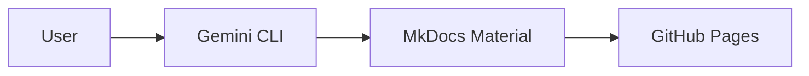

# 📚 Learning Pathways

Welcome to a curated collection of deep-dive learning paths for AI and Software Engineering.

## 🚀 Featured Paths

-   :simple-python: __LangChain Deep Dive__

    ---

    Master LangChain from first principles using Google Gemini.

    [:octicons-arrow-right-24: Start Learning](ai-engineering/langchain-path.md)

-   :simple-googlegemini: __AI Developer Mastery__

    ---

    A comprehensive roadmap for becoming a production-grade AI Engineer.

    [:octicons-arrow-right-24: Start Learning](ai-engineering/ai-mastery-plan.md)

## 📊 System Overview

