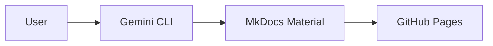

# UI/UX Improvements - Premium Developer Hub Implementation Plan

> **For agentic workers:** REQUIRED SUB-SKILL: Use superpowers:subagent-driven-development (recommended) or superpowers:executing-plans to implement this plan task-by-task. Steps use checkbox (`- [ ]`) syntax for tracking.

**Goal:** Enhance the visual identity and user experience of the Learning Pathways site using advanced MkDocs Material features and custom CSS.

**Architecture:** Updates to `mkdocs.yml` for theming and plugins, and a complete overhaul of `docs/assets/custom.css` for sophisticated styling.

**Tech Stack:** MkDocs Material, Mermaid.js, Google Fonts (Inter, Manrope), CSS Variables.

---

### Task 1: Typography, Color Palette & Core Extensions

**Files:**
- Modify: `mkdocs.yml`
- Modify: `docs/assets/custom.css`

- [ ] **Step 1: Update `mkdocs.yml` with fonts, colors, and required extensions**

```yaml
theme:
  name: material
  font:
    text: Inter
    code: Fira Code
  palette:
    - media: "(prefers-color-scheme: light)"
      scheme: default
      primary: indigo
      accent: teal
      toggle:
        icon: material/brightness-7
        name: Switch to dark mode
    - media: "(prefers-color-scheme: dark)"
      scheme: slate
      primary: indigo
      accent: teal
      toggle:
        icon: material/brightness-4
        name: Switch to light mode
  features:
    - navigation.tabs
    - navigation.tabs.sticky
    - navigation.sections
    - navigation.expand
    - navigation.top
    - navigation.tracking
    - navigation.instant
    - navigation.sticky
    - search.suggest
    - search.highlight
    - content.code.copy
    - content.tooltips
    - content.action.edit
    - content.action.view

extra_css:
  - assets/custom.css

markdown_extensions:
  - admonition
  - pymdownx.details
  - pymdownx.superfences:
      custom_fences:
        - name: mermaid
          class: mermaid
          format: !!python/name:pymdownx.superfences.fence_code_format
  - pymdownx.tabbed:
      alternate_style: true
  - pymdownx.emoji:
      emoji_index: !!python/name:material.extensions.emoji.twemoji
      emoji_generator: !!python/name:material.extensions.emoji.to_svg
  - attr_list
  - md_in_html

nav:
  - Home: index.md
  - AI Engineering:
      - ai-engineering/

repo_url: https://github.com/ishitvagoel/LeaningPathways
repo_name: ishitvagoel/LeaningPathways
edit_uri: edit/main/docs/

extra:
  analytics:
    feedback:
      title: Was this page helpful?
      ratings:
        - icon: material/emoticon-happy-outline
          name: This page was helpful
          data: 1
          note: >-
            Thanks for your feedback!
        - icon: material/emoticon-sad-outline
          name: This page could be improved
          data: 0
          note: >-
            Thanks for your feedback! Help us improve this page by
            opening an issue.
  social:
    - icon: fontawesome/brands/github
      link: https://github.com/ishitvagoel
```

- [ ] **Step 2: Add Manrope and CSS Variables to `custom.css`**

```css
@import url('https://fonts.googleapis.com/css2?family=Manrope:wght@700;800&display=swap');

:root {
  --md-primary-fg-color: #3f51b5; /* Deep Indigo */
  --md-accent-fg-color: #009688;  /* Emerald */
  --gradient-primary: linear-gradient(135deg, #3f51b5 0%, #009688 100%);
}

[data-md-color-scheme="default"] {
  --md-default-bg-color: #f8fafc;
}

[data-md-color-scheme="slate"] {
  --md-default-bg-color: #0f172a;
}

h1, h2, h3, .md-nav__title {
  font-family: 'Manrope', -apple-system, BlinkMacSystemFont, Helvetica, Arial, sans-serif !important;
  font-weight: 800;
  letter-spacing: -0.02em;
}
```

- [ ] **Step 3: Commit core theme changes**

```bash
git add mkdocs.yml docs/assets/custom.css
git commit -m "style: configure fonts, colors, and core markdown extensions"
```

---

### Task 2: Visual Elements, Hero Cards & Admonitions

**Files:**
- Modify: `docs/assets/custom.css`
- Modify: `docs/index.md`

- [ ] **Step 1: Style Hero Cards with Gradient Borders**

```css
.grid.cards > ul > li {
  position: relative;
  border-radius: 12px;
  box-shadow: 0 4px 6px -1px rgba(0, 0, 0, 0.1);
  transition: all 0.3s ease;
  background: var(--md-default-bg-color);
  overflow: hidden;
}

.grid.cards > ul > li:hover {
  transform: translateY(-4px);
  box-shadow: 0 20px 25px -5px rgba(0, 0, 0, 0.1);
}

.grid.cards > ul > li::before {
  content: "";
  position: absolute;
  top: 0; left: 0; right: 0; bottom: 0;
  border-radius: 12px;
  padding: 2px;
  background: var(--gradient-primary);
  -webkit-mask: linear-gradient(#fff 0 0) content-box, linear-gradient(#fff 0 0);
  -webkit-mask-composite: xor;
  mask-composite: exclude;
  opacity: 0;
  transition: opacity 0.3s ease;
}

.grid.cards > ul > li:hover::before {
  opacity: 1;
}
```

- [ ] **Step 2: Update `index.md` with High-Res Icons and Sample Mermaid**

```markdown
---
title: Welcome to Learning Pathways
---

# 📚 Learning Pathways

Welcome to a curated collection of deep-dive learning paths for AI and Software Engineering.

## 🚀 Featured Paths

<div class="grid cards" markdown>

-   :simple-python: __LangChain Deep Dive__

    ---

    Master LangChain from first principles using Google Gemini.

    [:octicons-arrow-right-24: Start Learning](ai-engineering/langchain-path.md)

-   :simple-googlegemini: __AI Developer Mastery__

    ---

    A comprehensive roadmap for becoming a production-grade AI Engineer.

    [:octicons-arrow-right-24: Start Learning](ai-engineering/ai-mastery-plan.md)

</div>

## 📊 System Overview


```

- [ ] **Step 3: Custom Admonition Styling & Mobile Micro-interactions**

```css
.md-typeset .admonition,
.md-typeset details {
  border-width: 0 0 0 4px;
  border-radius: 12px;
  box-shadow: 0 4px 6px -1px rgba(0, 0, 0, 0.05);
  overflow: hidden;
}

.md-typeset .admonition.note,
.md-typeset details.note {
  border-left-color: var(--md-primary-fg-color);
}

.md-typeset .admonition.tip,
.md-typeset details.tip {
  border-left-color: var(--md-accent-fg-color);
}

.md-typeset .admonition.warning,
.md-typeset details.warning {
  border-left-color: #ff9100; /* Amber Warning */
}

/* Mobile Micro-interactions */
@media (hover: none) {
  .grid.cards > ul > li:active {
    transform: scale(0.98);
    transition: transform 0.1s ease;
  }
}
```

- [ ] **Step 4: Commit visual elements**

```bash
git add docs/assets/custom.css docs/index.md
git commit -m "style: implement gradient hero cards, mermaid.js test, and premium admonitions"
```

---

### Task 3: Final Polish & Validation

- [ ] **Step 1: Verify all styles on mobile and desktop**
- [ ] **Step 2: Check for any layout shifts during theme toggle**
- [ ] **Step 3: Final push**

```bash
git push origin main
```
